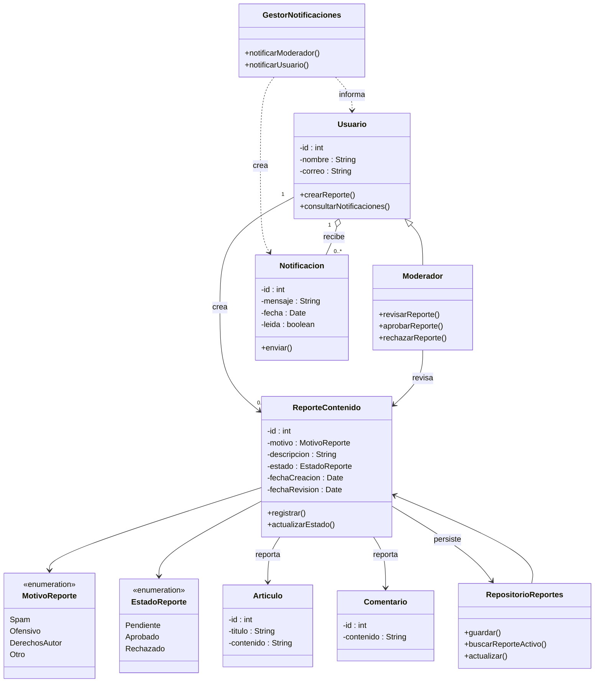

# Parte 2: Diagrama de Clases

```mermaid
classDiagram

class Usuario {
    -id : int
    -nombre : String
    -correo : String
    +crearReporte()
    +consultarNotificaciones()
}

class Moderador {
    +revisarReporte()
    +aprobarReporte()
    +rechazarReporte()
}

class Articulo {
    -id : int
    -titulo : String
    -contenido : String
}

class Comentario {
    -id : int
    -contenido : String
}

class ReporteContenido {
    -id : int
    -motivo : MotivoReporte
    -descripcion : String
    -estado : EstadoReporte
    -fechaCreacion : Date
    -fechaRevision : Date
    +registrar()
    +actualizarEstado()
}

class Notificacion {
    -id : int
    -mensaje : String
    -fecha : Date
    -leida : boolean
    +enviar()
}

class RepositorioReportes {
    +guardar()
    +buscarReporteActivo()
    +actualizar()
}

class GestorNotificaciones {
    +notificarModerador()
    +notificarUsuario()
}

class MotivoReporte {
    <<enumeration>>
    Spam
    Ofensivo
    DerechosAutor
    Otro
}

class EstadoReporte {
    <<enumeration>>
    Pendiente
    Aprobado
    Rechazado
}

Usuario <|-- Moderador

Usuario "1" --> "0..*" ReporteContenido : crea

ReporteContenido --> MotivoReporte

ReporteContenido --> EstadoReporte

ReporteContenido --> Articulo : reporta

ReporteContenido --> Comentario : reporta

ReporteContenido --> RepositorioReportes : persiste

GestorNotificaciones ..> Notificacion : crea

GestorNotificaciones ..> Usuario : informa

Moderador --> ReporteContenido : revisa

RepositorioReportes --> ReporteContenido

Usuario "1" o-- "0..*" Notificacion : recibe
```

