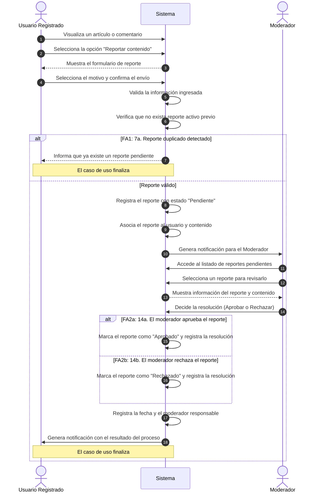

```mermaid
sequenceDiagram
    autonumber
    actor Usuario as Usuario Registrado
    participant Sistema as Sistema
    actor Moderador as Moderador

    %% Flujo Principal
    Usuario->>Sistema: Visualiza un artículo o comentario
    Usuario->>Sistema: Selecciona la opción "Reportar contenido"
    Sistema-->>Usuario: Muestra el formulario de reporte
    Usuario->>Sistema: Selecciona el motivo y confirma el envío
    
    %% Validaciones
    Sistema->>Sistema: Valida la información ingresada
    Sistema->>Sistema: Verifica que no exista reporte activo previo
    
    alt FA1: 7a. Reporte duplicado detectado
        Sistema-->>Usuario: Informa que ya existe un reporte pendiente
        Note over Usuario,Sistema: El caso de uso finaliza
    else Reporte válido
        Sistema->>Sistema: Registra el reporte con estado "Pendiente"
        Sistema->>Sistema: Asocia el reporte al usuario y contenido
        Sistema->>Moderador: Genera notificación para el Moderador
        
        Moderador->>Sistema: Accede al listado de reportes pendientes
        Moderador->>Sistema: Selecciona un reporte para revisarlo
        Sistema-->>Moderador: Muestra información del reporte y contenido
        
        Moderador->>Sistema: Decide la resolución (Aprobar o Rechazar)
        
        alt FA2a: 14a. El moderador aprueba el reporte
            Sistema->>Sistema: Marca el reporte como "Aprobado" y registra la resolución
        else FA2b: 14b. El moderador rechaza el reporte
            Sistema->>Sistema: Marca el reporte como "Rechazado" y registra la resolución
        end
        
        Sistema->>Sistema: Registra la fecha y el moderador responsable
        Sistema->>Usuario: Genera notificación con el resultado del proceso
        Note over Usuario,Sistema: El caso de uso finaliza
    end
```
