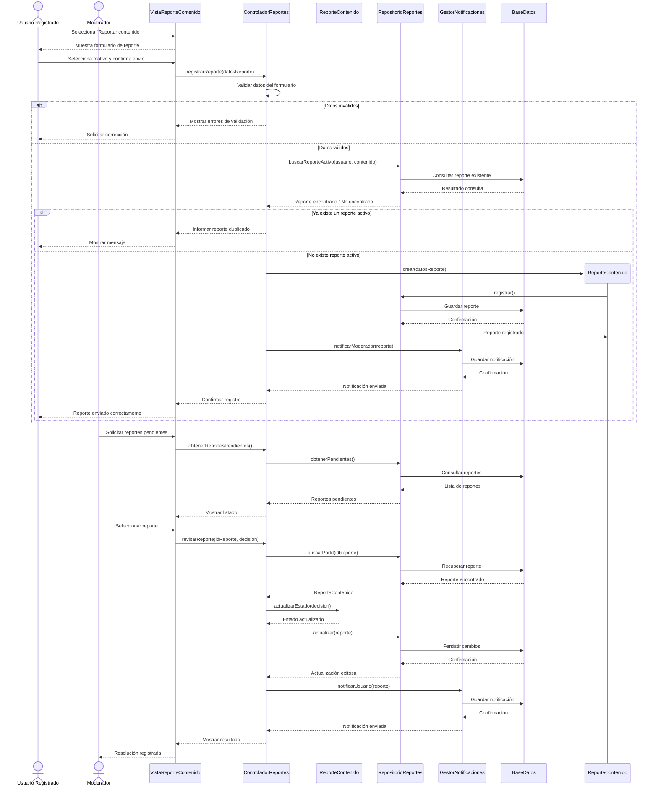

# Parte 2: Diagrama de Secuencia

```mermaid
sequenceDiagram

actor UsuarioRegistrado as Usuario Registrado
actor Moderador

participant Vista as VistaReporteContenido
participant Controlador as ControladorReportes
participant Reporte as ReporteContenido
participant Repositorio as RepositorioReportes
participant Gestor as GestorNotificaciones
participant BaseDatos

UsuarioRegistrado->>Vista: Selecciona "Reportar contenido"
Vista-->>UsuarioRegistrado: Muestra formulario de reporte

UsuarioRegistrado->>Vista: Selecciona motivo y confirma envío

Vista->>Controlador: registrarReporte(datosReporte)

Controlador->>Controlador: Validar datos del formulario

alt Datos inválidos
    Controlador-->>Vista: Mostrar errores de validación
    Vista-->>UsuarioRegistrado: Solicitar corrección
else Datos válidos

    Controlador->>Repositorio: buscarReporteActivo(usuario, contenido)
    Repositorio->>BaseDatos: Consultar reporte existente
    BaseDatos-->>Repositorio: Resultado consulta
    Repositorio-->>Controlador: Reporte encontrado / No encontrado

    alt Ya existe un reporte activo
        Controlador-->>Vista: Informar reporte duplicado
        Vista-->>UsuarioRegistrado: Mostrar mensaje
    else No existe reporte activo

        create participant NuevoReporte as ReporteContenido
        Controlador->>NuevoReporte: crear(datosReporte)

        NuevoReporte->>Repositorio: registrar()
        Repositorio->>BaseDatos: Guardar reporte
        BaseDatos-->>Repositorio: Confirmación
        Repositorio-->>NuevoReporte: Reporte registrado

        Controlador->>Gestor: notificarModerador(reporte)
        Gestor->>BaseDatos: Guardar notificación
        BaseDatos-->>Gestor: Confirmación

        Gestor-->>Controlador: Notificación enviada

        Controlador-->>Vista: Confirmar registro
        Vista-->>UsuarioRegistrado: Reporte enviado correctamente

    end
end

Moderador->>Vista: Solicitar reportes pendientes

Vista->>Controlador: obtenerReportesPendientes()

Controlador->>Repositorio: obtenerPendientes()

Repositorio->>BaseDatos: Consultar reportes

BaseDatos-->>Repositorio: Lista de reportes

Repositorio-->>Controlador: Reportes pendientes

Controlador-->>Vista: Mostrar listado

Moderador->>Vista: Seleccionar reporte

Vista->>Controlador: revisarReporte(idReporte, decision)

Controlador->>Repositorio: buscarPorId(idReporte)

Repositorio->>BaseDatos: Recuperar reporte

BaseDatos-->>Repositorio: Reporte encontrado

Repositorio-->>Controlador: ReporteContenido

Controlador->>Reporte: actualizarEstado(decision)

Reporte-->>Controlador: Estado actualizado

Controlador->>Repositorio: actualizar(reporte)

Repositorio->>BaseDatos: Persistir cambios

BaseDatos-->>Repositorio: Confirmación

Repositorio-->>Controlador: Actualización exitosa

Controlador->>Gestor: notificarUsuario(reporte)

Gestor->>BaseDatos: Guardar notificación

BaseDatos-->>Gestor: Confirmación

Gestor-->>Controlador: Notificación enviada

Controlador-->>Vista: Mostrar resultado

Vista-->>Moderador: Resolución registrada
```